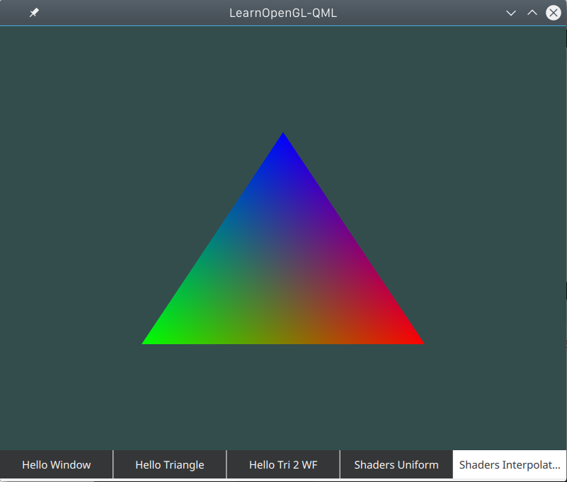
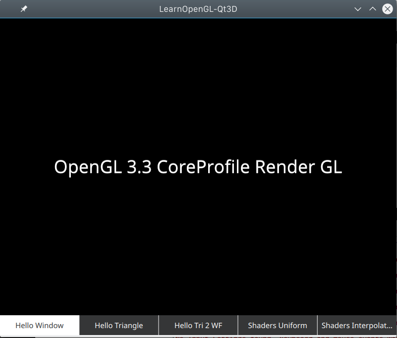
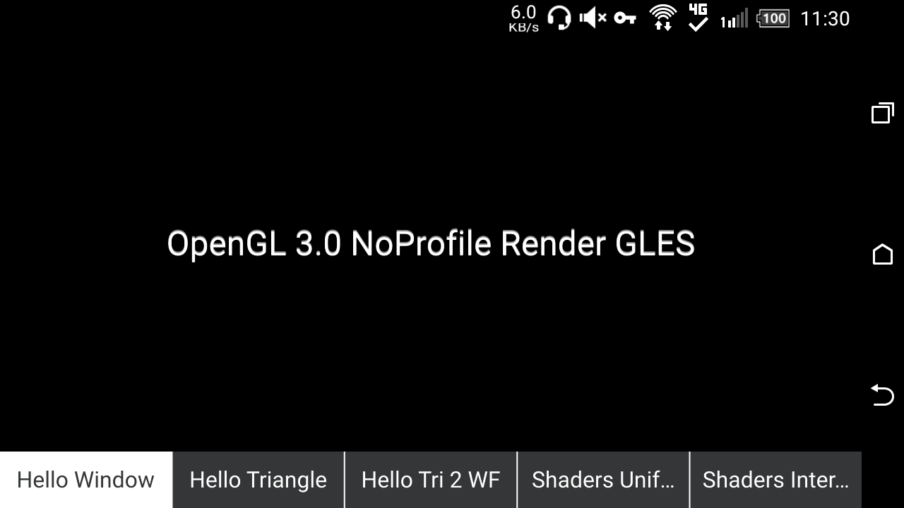

# learnopengl-qt3d

Qt3D version of http://learnopengl.com/ examples

**Just want to see how OpenGL works in Qt3D undocumented libs~**

qml-glDefault
----
Pure QML version, use qmlscene to run with default OpenGL Context (GL3.0 for QtQuick 2.7)

qt3d-gl33
----
Compiled version, context set to GL3.3/GLES NoProfile, can run on Android

