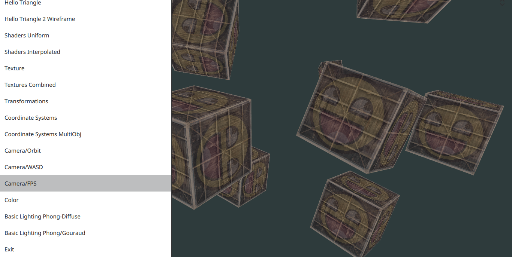
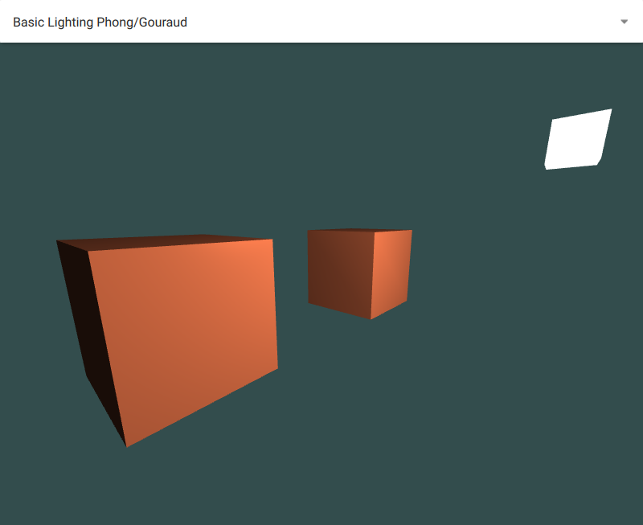
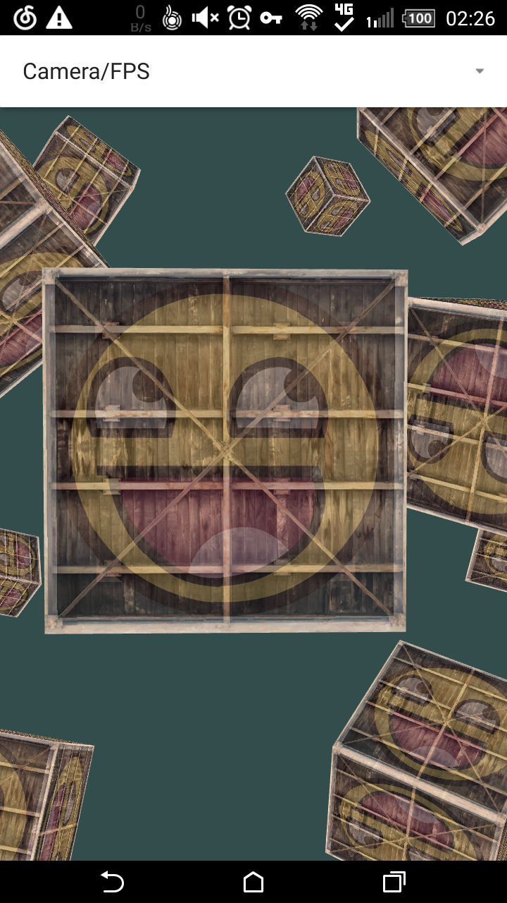

# learnopengl-qt3d

Qt3D version of http://learnopengl.com/ examples, currently works with Qt5.7

**Just want to see how OpenGL works in Qt3D undocumented libs~**

Pure QML version, use qmlscene to run with default OpenGL Context (GL3.0 for QtQuick 2.7), shaders are GLES2.0 compatible

Compiled version, context set to GL3.3/GLES, can run on Android

notes
===

Main qml file for qmlscene/binary/QmlCreator

* app.qml: main window with line chart FPS display

* app-cpp.qml: main window with text FPS display

* main.qml: QuickItem as root + text FPS display

You can lauch one sample with a keyword like:

* qmlscene skybox app.qml
* ./learnopengl-qt3d geometry

**Some large assets from the website is downloaded by qmake script(*nix compatible), connection is required at the first build or after updated. See assets.pri for details**

**leanopengl uses a little different lighting model from Qt3D default model, to rendering models for a better result, please slightly modify the ka, kd in mtl files**

Examples
===

* Hello Window : works

* Hello Triangle : works

* Hello Triangle 2 Wireframe : works

* Shaders Uniform : works

* Shaders Interpolated : works

* Texture : works

* Textures Combined : NEW sRGB color format get wierd output

* Transformations : works

* Coordinate Systems : works

* Coordinate Systems MultiObj : works

* Camera/Orbit : works

* Camera/WASD : works

* Camera/FPS : Qt3D FPS Controller can go up-side-down!!

* Color : works

* Basic Lighting Phong-Diffuse : works

* Basic Lighting Phong/Gouraud : works

* Material : works

* Diffuse Specular Map : works

* Diffuse Specular Emission Map : works

* Directional Light : works

* Spot Light(hard) : works

* Multiple Lights : why quadratic attenuation model is in gl3 shaders only?

* Import Models : 

	* SceneLoader is buggy, crashes on destroy
	
	* Not work on Android
	
	* Sometimes the 2nd bot is not shown

* Stencil Testing : works

* Discard Blend : works, bad performance on my phone

* Alpha Blend: BlendEquationArguments, what is the right parameters??

* Framebuffer :

	* RenderTargetOutput with color crashes on destroy
	
	* Not work on my phone: GL_INVALID_OPERATION

* Skybox : HiRes texture can easily get GL_OUT_OF_MEMORY on my phone

* Simple Glass : works

* Glass Texture : don't know how to manipulate SceneLoader models

* Geometry Shader : only GL3.3 Core version, **need for GLES version**

* Instancing : 

	* Require gl_InstanceID, only GL3.3 Core version, **need for GLES version**
	
	* The rocks are CLIPPED!!! **need fix**

* Lighting Blinn-Phong : Tab/Space key may conflict with Combobox

---

* TEST/BIGMODEL : super bad performance on my phone ~12fps

* TEST/PLASMA : noise on Desktop, wrong placement on Android -> precision problem??
