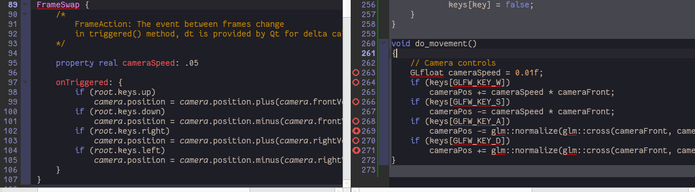
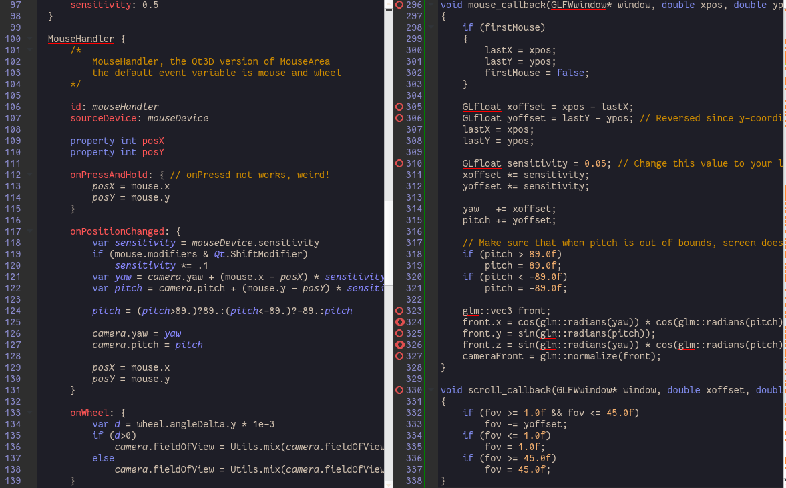

Camera
======

This section is full of things about mathematics. We just need a QML type to handle camera calculations, there it is, the Camera QML type. But we can DIY fully because it is just math, aha?

Qt has covered what glm could provided for us:

> vector, matrix, quaternion...

Read the examples and documents to unleash your power.

> Tips:
>
> -	Hey, quaternion in QML sucks! I have ported one copy of my javascript geometry library in geo.js for convenience.
> -	The Qt3D internal Camera type will be introduced in the next article.

[camera_circle](../qml/camera_circle.qml)
-----------------------------------------

[camera_keyboard](../qml/camera_keyboard.qml)
---------------------------------------------

Remember FrameSwap? It's true type is FrameAction, the event between frames. We should always adjust geometries and handle physics here.



> Tips:
>
> -	The Qt3D Logic based camera controller helps you handling camera moving, check out in [OurCameraController.qml](../qml/Components/OurCameraController.qml).

[camera\_keyboard\_dt](../qml/camera_keyboard_dt.qml)
-----------------------------------------------------

FrameAction support dt internally, we just calculate FPS by this argument.

[camera_zoom](../qml/camera_zoom.qml)
-------------------------------------

Use MouseHandler the way you do to MouseArea, modifiers can be passed into mouse event, try to press Shift for accurate aiming. Need zoom for touchscreen? You may need an outer PinchArea.



[camera_quaternion](../qml/camera_quaternion.qml)
-------------------------------------------------

To keep upVector up you need to decompose rotation into two axes(yaw and pitch):

```javascript
	qx = qx.times(rx);
	qy = qy.times(ry);
	quaternion = qx.times(qy)
```

It is more easy to create rotation in quaternion and there is difference with Euler angle, for example you no longer need to **lookAt**! 

```javascript
	var translation = Qt.matrix4x4();
	translation.m14 = -position.x;
	translation.m24 = -position.y;
	translation.m34 = -position.z;
	viewMatrix = quaternion.conjugated().toMatrix()
		.toQtType().times(translation);
```

Try and you can tell it.

[camera-exercise1](../qml/camera-exercise1.qml)
-----------------------------------------------

You may enjoy the world you can not fly but infinite jump!

[camera-exercise2](../qml/camera-exercise2.qml)
-----------------------------------------------
