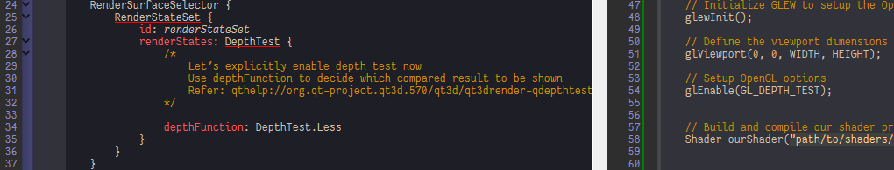
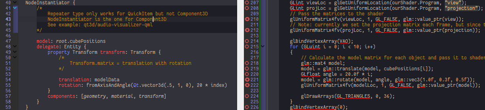

Coordinate Systems
==================

Qt3D handle your coordinate transform with internal types like Transform and Camera, where Transform gives model matrices and Camera generate view and projection matrices, to add Transform to an object, add it into components:

```qml
Entity {
  Transform {
    id: transform
  }
  components: [transform]
}
```

[coordinate_systems](../qml/coordinate_systems.qml)
---------------------------------------------------

[coordinate_systems_with_depth](../qml/coordinate_systems_with_depth.qml)
-------------------------------------------------------------------------

1.	Qt3D is by default enabled depth test, to disable it we need explicit declare an empty RenderStateSet, when we need depth test, add DepthTest into it:



[coordinate_systems_multiple_objects](../qml/coordinate_systems_multiple_objects.qml)
-------------------------------------------------------------------------------------

1.	It is really cool to use QML model delegate, just the same with [Repeater](qthelp://org.qt-project.qtquick.570/qtquick/qml-qtquick-repeater.html), [NodeInstantiator](qthelp://org.qt-project.qt3d.570/qt3d/qml-qt3d-core-nodeinstantiator.html) helps you create mass objects in your scene, we just need to bind different transforms with same geometry and shaders:



[coordinate_systems-exercise1](../qml/coordinate_systems-exercise1.qml)
-----------------------------------------------------------------------

[coordinate_systems-exercise2](../qml/coordinate_systems-exercise2.qml)
-----------------------------------------------------------------------

[coordinate_systems-exercise3](../qml/coordinate_systems-exercise3.qml)
-----------------------------------------------------------------------
