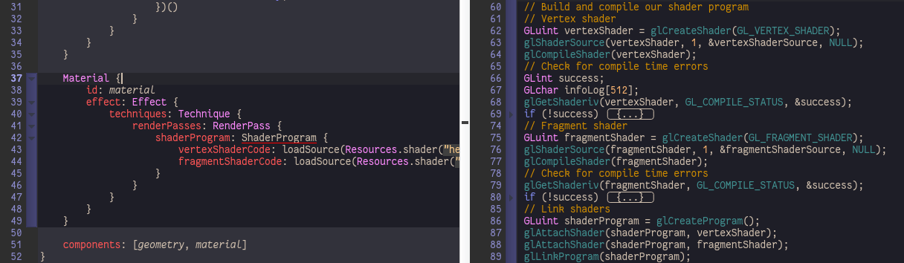
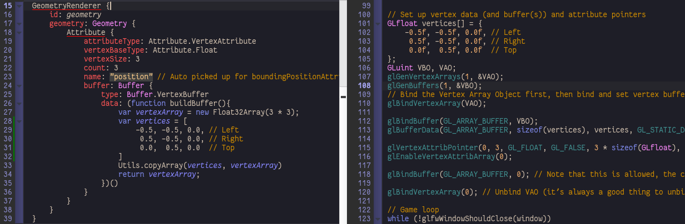
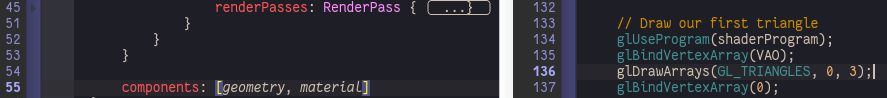
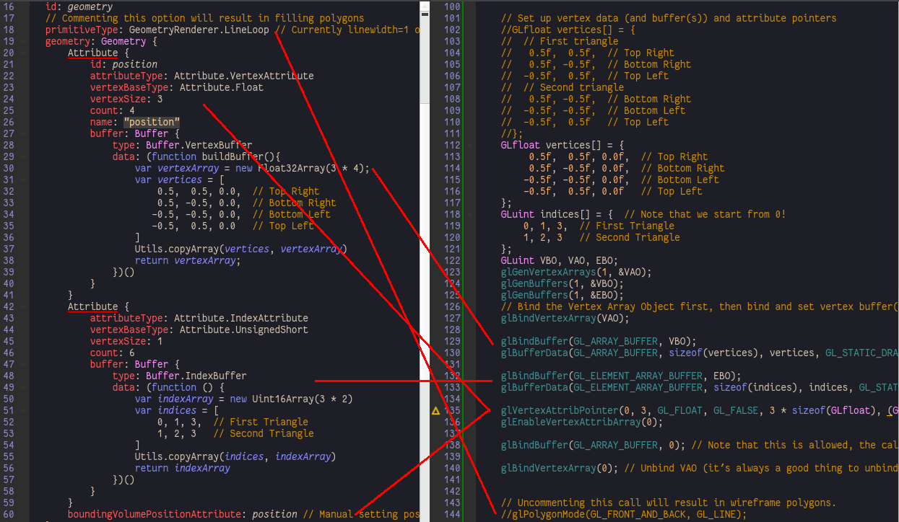

Hello Triangle
==============

Any Qt3D renderable Entity is assembled with three parts:

> vertices, transforms, shaders

in qml code:

```qml
Entity {

	GeometryRenderer {
		id: geometry
	}

	Transform {
		id: transform
	}

	Material {
		id: material
	}

	components: [geometry, transform, material]
}
```

There is no z-order or render order for unassembled entities, thus any following style works:

```qml
GeometryRenderer {
	id: geometry
}

Transform {
	id: transform
}

Material {
	id: material
}

Entity {
	components: [geometry, transform, material]
}
```

```qml

Transform {
	id: transform
}

Material {
	id: material
}

Entity {

	GeometryRenderer {
		id: geometry
	}

	components: [geometry, transform, material]
}
```

Flow
----

```
GeometryRenderer <- Geometry <- Attribute <- Buffer <- vertices
      |                             |          |           |
      V                             ------------------------
Transform  ------------------------------------>    |
      |                                             |
      V                                             V
Material -> Effect -> Technique -> RenderPass -> ShaderProgram
```

[hellotriangle](../qml/hellotriangle.qml)
-----------------------------------------

1.	Use ShaderProgram to link shader program flow:

	

2.	Use Attribute to bind VBO

	

3.	Entity.components assmbles vertices and shader programs to scene graph, RenderPass set the render flow (using default settings).

	

> Tips:
>
> -	The scene graph nodes can be inspected by tools like [Gammaray](https://www.kdab.com/development-resources/qt-tools/gammaray/).

[hellotriangle2](../qml/hellotriangle2.qml)
-------------------------------------------

1.	Corresponding...:

	

[hello-triangle-exercise1](../qml/hello-triangle-exercise1.qml)
---------------------------------------------------------------

[hello-triangle-exercise2](../qml/hello-triangle-exercise2.qml)
---------------------------------------------------------------

You can generate 2 different geometry, bind two entities with them and the same material

[hello-triangle-exercise3](../qml/hello-triangle-exercise3.qml)
---------------------------------------------------------------

loadSource returns QByteArray, you need toString() and then manipulate the string in javascript
