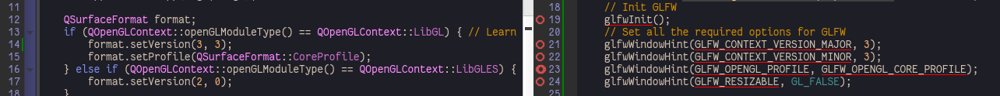
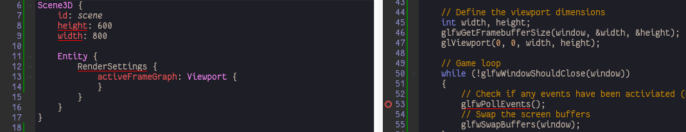
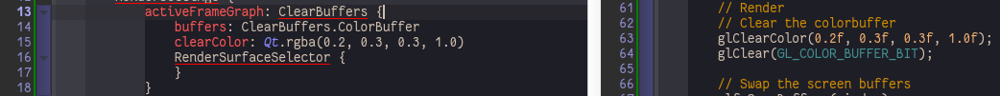

Hello Window
============

**Scene3D** is the QtQuick component to bridge QtQuick and Qt3D, Scene3D is a QQuickItem, its Component3D children can be rendered in the 3D scene.

There are several ways to create Qt3D scene ([https://forum.qt.io/topic/68781/scene3d-vs-qt3dquickwindow-pictures-differ/2](https://forum.qt.io/topic/68781/scene3d-vs-qt3dquickwindow-pictures-differ/2)\)

1.	Qt3DQuickWindow + Component3D components for pure Qt3D app:

	```c++
	Qt3DExtras::Quick::Qt3DQuickWindow view;
	view.setSource(QUrl("qrc:/main.qml"));
	view.show();
	```

	Input is auto captured by default for Qt3DQuickWindow. Where main.qml starts with root entity:

	```qml
	Entity {
	    id: sceneRoot
	    ...
	}
	```

2.	QQuickView with QtQuick default GL context + Scene3D:

	```c++
	QQuickView view;
	view.setResizeMode(QQuickView::SizeRootObjectToView);
	view.setSource(QUrl("qrc:/main.qml"));
	view.show();
	```

	Where main.qml starts with QQuickItem:

	```qml
	Item {
	    id: view
	    ...
	    Scene3D {
	    id: scene
	    }
	}
	```

3.	QQuickView with different GL context + Scene3D:

	```c++
	QSurfaceFormat format;
	if (QOpenGLContext::openGLModuleType() == QOpenGLContext::LibGL) {
	    format.setVersion(3, 3);
	    format.setProfile(QSurfaceFormat::CoreProfile);
	}
	format.setDepthBufferSize(24);
	format.setStencilBufferSize(8);
	format.setSamples(4);


	QQuickView view;
	view.setResizeMode(QQuickView::SizeRootObjectToView);
	view.setSource(QUrl("qrc:/main.qml"));
	view.show();
	```

	Where main.qml starts with QQuickItem, advance GL context is available:

	```qml
	Item {
	    id: view
	    ...
	    Scene3D {
	        id: scene
	    ...
	    /* GL33 Shaders*/
	    ...
	    }
	}
	```

4.	QQmlApplicationEngine with different GL context + Scene3D:

	```c++
	QSurfaceFormat format;
	if (QOpenGLContext::openGLModuleType() == QOpenGLContext::LibGL) {
	    format.setVersion(4, 3);
	    format.setProfile(QSurfaceFormat::CoreProfile);
	} else if (QOpenGLContext::openGLModuleType() == QOpenGLContext::LibGLES) {
	    format.setVersion(2, 0);
	}


	format.setAlphaBufferSize(0);
	format.setDepthBufferSize(0);
	format.setRenderableType(QSurfaceFormat::OpenGL);
	format.setSamples(4);
	format.setStencilBufferSize(0);
	format.setSwapBehavior(QSurfaceFormat::TripleBuffer);
	format.setSwapInterval(0);


	QSurfaceFormat::setDefaultFormat(format);


	QQmlApplicationEngine engine;
	engine.load(QUrl(QLatin1String("qrc:/main.qml")));
	```

	Where main.qml starts with Window, advance GL context is available:

	```qml
	ApplicationWindow {
	    id: app
	    ...
	    Scene3D {
	        id: scene
	    ...
	    /* GL33 Shaders*/
	    ...
	    }
	}
	```

	That's how our application starts with.

> Tips:
>
> -	To append QtQuick Item on Scene3D, use property **children**

[hellowindow](../qml/hellowindow.qml)
-------------------------------------

1.	Use QSurfaceFormat to set global GL context:

	

2.	Set a Viewport to activeFrameGraph making render flow complete:

	

[hellowindow2](../qml/hellowindow2.qml)
---------------------------------------

1.	Viewport is a FrameGraphNode, ClearBuffers is another one with clearbuffer setting, **note buffers is usually set to ClearBuffers.ColorDepthBuffer even no depth order in your scene (see [Hello-Triangle](Hello-Triangle.md)\)**:

	
