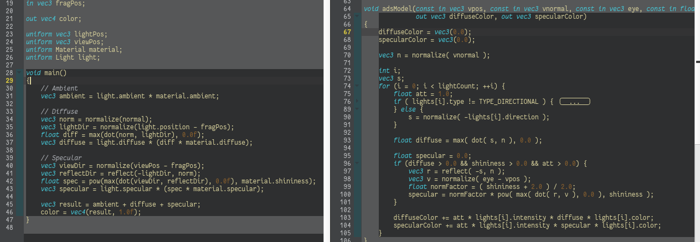

Materials
==============

[materials](../qml/materials.qml)
-----------------------------------------------------------

Qt3D manage internal simple light types with Qt3D render module, in this case we can choose type PointLight to replace our lighting source, working with Qt3D's Phong's/ADS lighting shaders from Qt3D.Extras PhongMaterial. The core implementation can be found in **Src/qt3d/src/extras/shaders/gl3/light.inc.frag** :

	
The complete Lambertian lighting model and the difference will be discussed in later sections.

[materials-exercise1](../qml/materials.qml)
-------------------------------------------------------------

The main code has implemented the exercise one, loading model data from web with QtQuick XmlListModel.