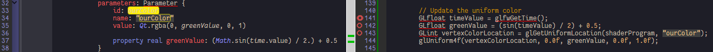
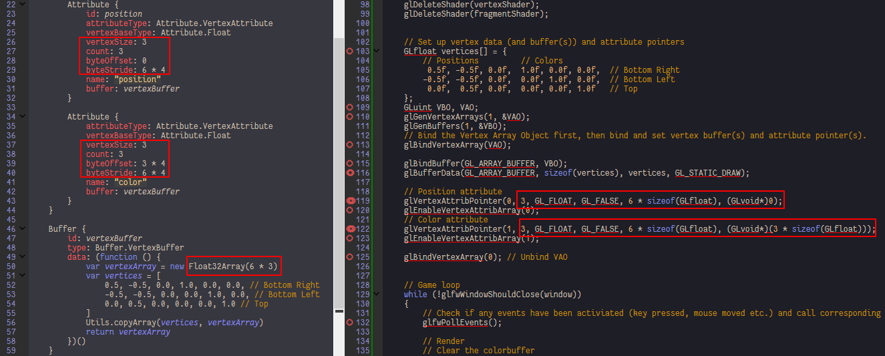

Shaders
=======

In Effect, parameters are the binding between uniform variables and QML properties, in single item list, brackets can be ignored:

```qml
parameters: Parameter {
	name: "uniform"
	value: item.value
}
```

```qml
parameters: [
	Parameter {},
	Parameter {},
	Parameter {}
}
```

> Tips:
>
> -	The filepath of shaders does not accept qml relative paths, a filepath error may lead to program crash.

[shaders-uniform](../qml/shaders-uniform.qml)
---------------------------------------------

1.	Uniform binding:

	

[shaders-interpolated](../qml/shaders-interpolated.qml)
-------------------------------------------------------

1.	Setup size, count, offset, stride for one vertex buffer with several attributes:

	

[shaders-exercise1](../qml/shaders-exercise1.qml)
-------------------------------------------------

[shaders-exercise2](../qml/shaders-exercise2.qml)
-------------------------------------------------

[shaders-exercise3](../qml/shaders-exercise3.qml)
-------------------------------------------------
