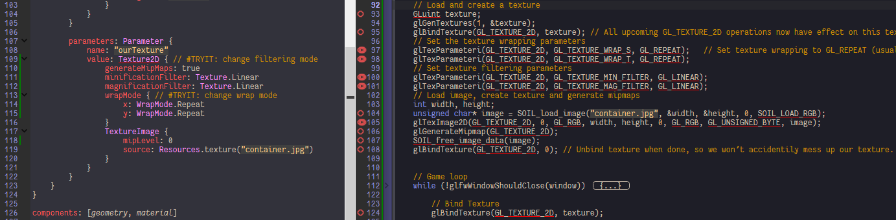

Texture
=======

To use texture in uniform, assign Texture to Parameter value. (Abstract)Texture does not contain any pixmap, one and only one TextureImage is required to attached to it for texture image binding. Currently in Qt3D TextureImage can only be loaded from local files or qrc, neither web resources or QImage/QPixmap memory resources is directly supported.

```qml
Parameter {
	name: "texture"
	value: Texture2D {
		TextureImage {
			source: "texture.jpg"
		}
	}
}
```

[textures](../qml/textures.qml)
-------------------------------

1.	Control and adjust texture details in Texture:

	

[textures2](../qml/textures2.qml)
---------------------------------

[textures_combined](../qml/textures_combined.qml)
-------------------------------------------------

[textures-exercise1](../qml/textures-exercise1.qml)
---------------------------------------------------

[textures-exercise2](../qml/textures-exercise2.qml)
---------------------------------------------------

[textures-exercise3](../qml/textures-exercise3.qml)
---------------------------------------------------

[textures-exercise4](../qml/textures-exercise4.qml)
---------------------------------------------------

This exercise need more knowledge of Qt3D input system.

To capture keyboard input, we need to import Qt3D.Input, give our Scene focus and setup up the eventSource of root entity to our scene (by InputSettings automatically). Generally it looks like the following:

```qml
Scene {
	focus: true
	aspects: ["input"]

	Entity {
		id: root

		InputSettings {}
	}
}
```

Then a KeyboardDevice is required to add in to root entity, we can now happily handle keyboard events in its KeyboardHandler.
