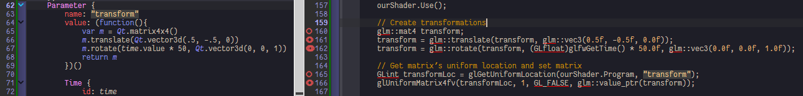
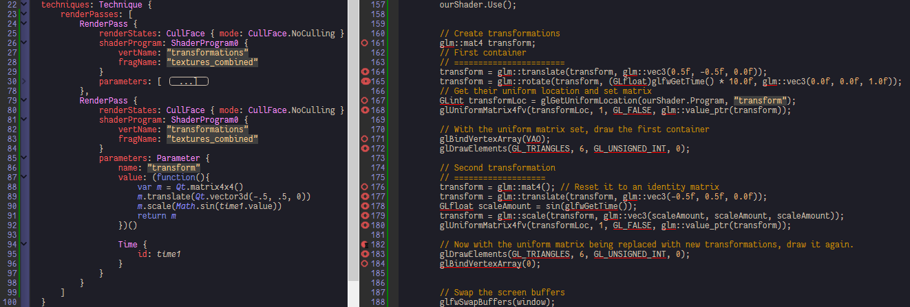

Transformations
===============

In Qt we have types for math calculation such as vector3d, matrix4x4, to generate transformations we can do calculation based on them, for details please see Qt's documentaion about basic QML types.

```qml
var m = Qt.matrix4x4()
m.translate(Qt.vector3d(1, -1, 0).times(.5))
m = m.times(rotateAround(joint, angle, Qt.vector3d(0,0,1)))
```

> Tips:
>
> -	The Qt3D internal Transform type (will be introduced in [Coordinate-Systems#coordinate_systems_with_depth](Coordinate-Systems.md)) only process rigid transform. So cubes will not be sheared or skewed into parallelepiped.

[transformations](../qml/transformations.qml)
---------------------------------------------

1.	Give a mat4 uniform a binding of our time value:



[transformations-exercise1](../qml/transformations-exercise1.qml)
-----------------------------------------------------------------

[transformations-exercise2](../qml/transformations-exercise2.qml)
-----------------------------------------------------------------

The original program makes 2 glDraw call with the same shader, in Qt3D we should change the uniform in another render pass where only transform is changed. By the way, parameters can be set in several rendering classes, this time we put them into RenderPass:


