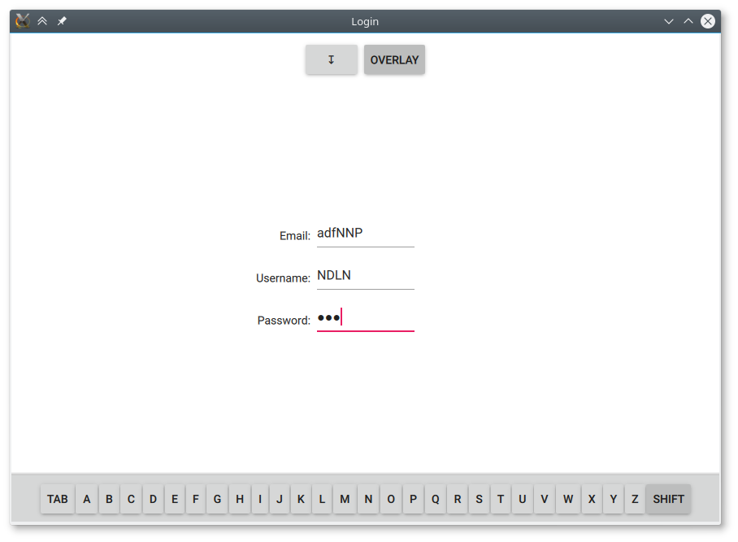
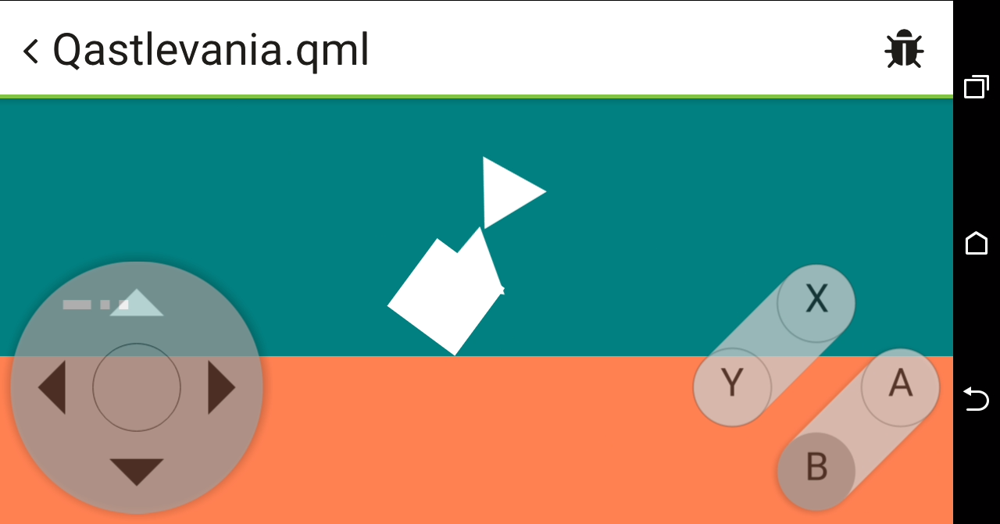
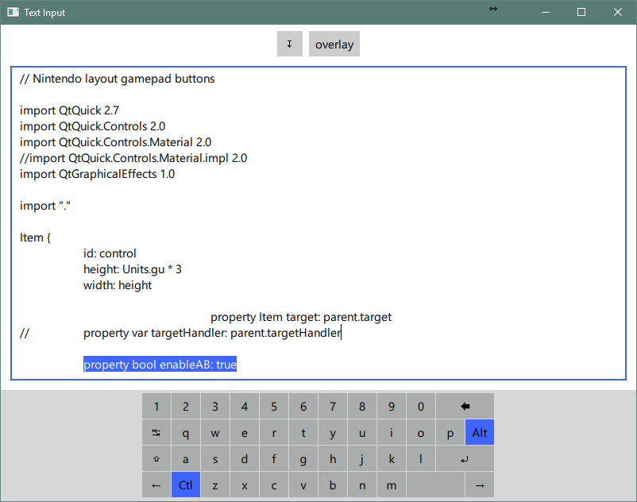
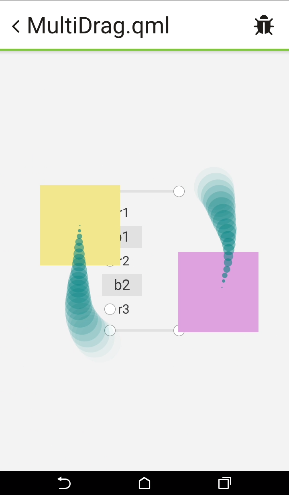

# qml-virtualkey
Pure QML in-app virtual key/keyboard/pad

##[VirtualKey](./VirtualKey/VirtualKey.qml)

##[GamePad](./VirtualKey/GameButtons.qml)

##[VirtualKeyboard](./VirtualKey/VirtualKeyboard.qml)

##[Multitouch MouseArea](./VirtualKey/MutitouchDispatcher.qml)

